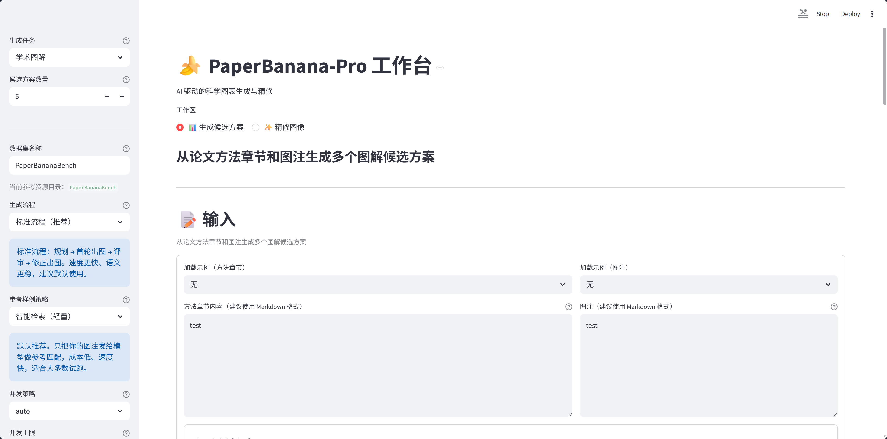
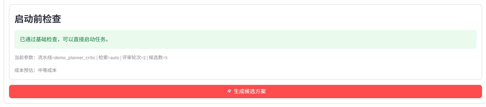
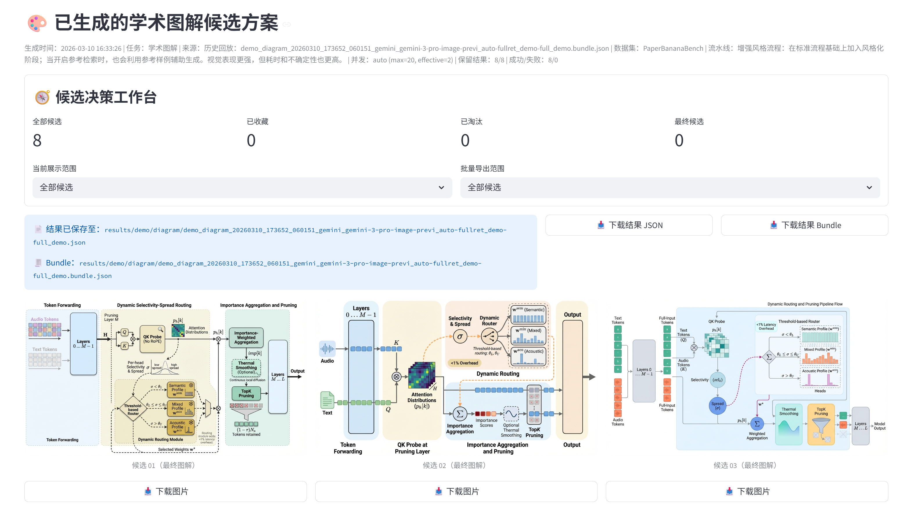
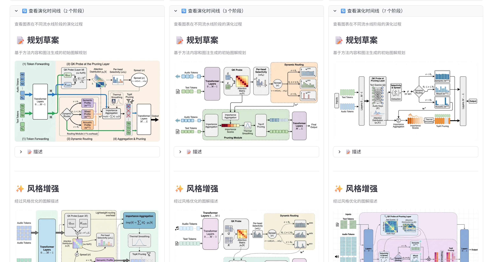
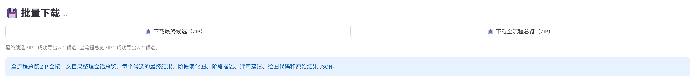
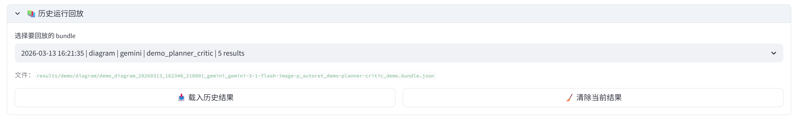
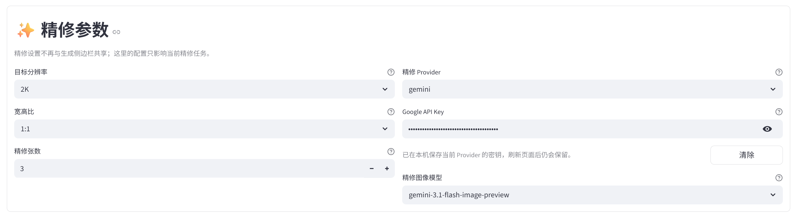
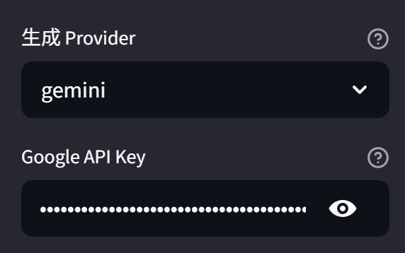

# PaperBanana-Pro

> Multi-agent scientific illustration & chart generation system with Chinese GUI, CLI batch processing, and result review tools.

[](https://huggingface.co/datasets/dwzhu/PaperBananaBench)
[](https://huggingface.co/papers/2601.23265)


## ✨ Features

### Generation Workspace — 生成候选方案



Input your paper's methodology section and figure caption, then generate multiple scientific illustration candidates in one click. The sidebar provides task selection (academic diagram / statistical plot), pipeline modes, and retrieval strategies — all in a fully localized Chinese interface with fine-grained parameter controls.

### Preflight Validation — 启动前检查



Before execution, the system automatically validates parameter configurations and previews estimated cost. Confirm and launch with a single click.

### Candidate Review & Decision — 候选结果与决策



Each generated candidate displays the final illustration alongside download links and decision buttons (Favorite / Set as Final / Eliminate). Send any candidate directly to the refine workspace for further polish.

### Full Pipeline Visualization — 完整流水线展开



Expand any candidate to inspect the full pipeline trace: planner output, stylist refinement, critic feedback, and revision history — all in one view.

### Batch Download — 一键批量下载



### History Replay — 历史回放



### Image Refinement (2K / 4K) — 图像精修



A dedicated refinement workspace supporting target resolution, aspect ratio, and concurrent refinement count. Each round creates a version chain — resume or roll back from any historical version.

## 🚀 Quick Start

### 1. Installation

```bash
git clone https://github.com/elpsykongloo/PaperBanana-Pro.git
cd PaperBanana-Pro
uv python install 3.12
uv sync --locked
uv tool install --editable . --force
```

After installation, `paperbanana` is available globally. If it's not on your PATH, run `uv tool update-shell`.

> [!TIP]
> Prefer not to install globally? Run `streamlit run demo.py` for the GUI, or `python main.py --help` for CLI.

### 2. Dataset (Optional but Recommended)

Download [`dwzhu/PaperBananaBench`](https://huggingface.co/datasets/dwzhu/PaperBananaBench) and place it under `data/PaperBananaBench/`. This dataset provides few-shot reference examples and evaluation benchmarks.

To skip the dataset dependency, set the retrieval strategy to `none`.

### 3. API Key Setup

```bash
cp configs/model_config.template.yaml configs/model_config.yaml
```

Add your API key to `configs/model_config.yaml`, or save it to one of the following files:

- `configs/local/google_api_key.txt`
- `configs/local/evolink_api_key.txt`

Supported providers: **Gemini** and **Evolink**.

You can also configure keys directly in the GUI — they will be persisted locally:



### 4. Launch

```bash
paperbanana        # Equivalent to `paperbanana gui`; starts the web UI on port 8501
```

## 📖 Usage Guide

### GUI — Primary Interface

```bash
paperbanana gui
```

Two core workspaces:

- **Generation** — `diagram` (scientific illustrations) or `plot` (statistical charts). Supports background generation, concurrent candidates, real-time preview, history replay, and batch export.
- **Refinement** — Edit, upscale, and iterate on candidates. Supports version history, concurrent refinement, and batch download.

### CLI — Batch Processing

```bash
paperbanana run --task_name diagram --exp_mode demo_full --provider gemini
```

Designed for dataset-scale batch runs and artifact archiving.

| Parameter | Description |
| --- | --- |
| `--task_name` | `diagram` or `plot` |
| `--exp_mode` | Pipeline mode, e.g. `demo_full`, `demo_planner_critic` |
| `--provider` | `gemini` / `evolink` |
| `--max_critic_rounds` | Max review rounds (set `0` to disable) |
| `--retrieval_setting` | Retrieval mode: `auto`, `curated`, `none`, etc. |
| `--resume` | Auto-resume from the last interrupted run |

See `paperbanana run --help` for the full parameter list.

### Viewer — Result Review

```bash
paperbanana viewer evolution   # View pipeline evolution traces
paperbanana viewer eval        # View evaluation results with references
```

## 🏗️ Architecture


| Stage | Purpose |
| --- | --- |
| Retriever | Retrieve few-shot examples from the reference pool |
| Planner | Generate structured visualization descriptions |
| Stylist | Refine academic expression and style consistency |
| Visualizer | Produce images (diagram) or Matplotlib code (plot) |
| Critic | Multi-round review and revision suggestions |
| Polish | Optional post-processing refinement |

## 📁 Project Structure

```text
PaperBanana-Pro/
├── agents/          # Multi-agent stage implementations
├── configs/         # Model & API key configurations
├── data/            # Dataset directory
├── visualize/       # Streamlit Viewer apps
├── cli.py           # Global CLI entry point
├── demo.py          # GUI main application
├── main.py          # CLI batch runner
└── pyproject.toml   # Project metadata & dependencies
```

## 🗺️ Roadmap

- [ ] Multi-language UI & prompt support
- [ ] Expand to more conference datasets (ICML, ACL, etc.) for diverse style coverage
- [ ] Integrate iterative critique loop into the refinement workspace
- [ ] Structured plot contracts with auto-repair (`PlotSpec`)
- [ ] No-reference automatic quality assessment
- [ ] Publish to PyPI (`uv tool install paperbanana-pro`)

## 🙏 Acknowledgements

This project evolved independently from the following work:

- Original repository: [`dwzhu-pku/PaperBanana`](https://github.com/dwzhu-pku/PaperBanana)
- Chinese interface & lightweight retrieval: [`Mylszd/PaperBanana-CN`](https://github.com/Mylszd/PaperBanana-CN)
- Paper: [*PaperBanana: Automating Academic Illustration for AI Scientists*](https://huggingface.co/papers/2601.23265)

## 📄 License

Apache-2.0
